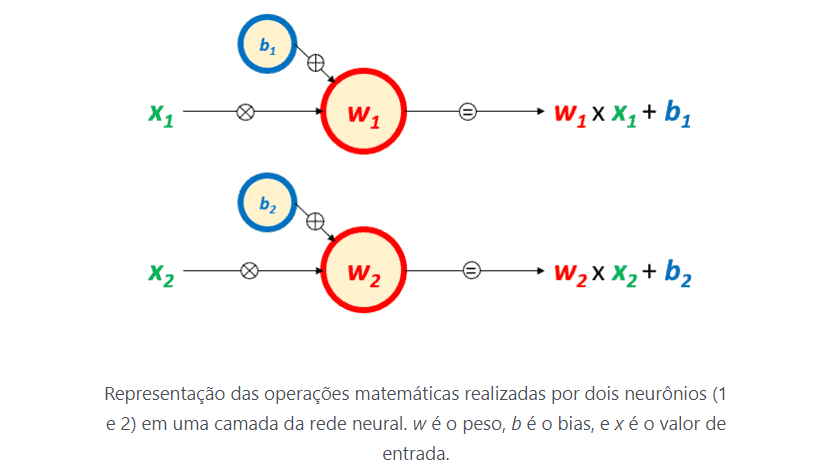

### Redes neurais 
As redes neurais são estruturas que promovem transformações matemáticas nos dados que recebem para processar. Em cada neurônio de cada camada, elas multiplicam o valor de entrada pelo peso do neurônio correspondente, somam com o bias (viés) associado ao neurônio e passam esse valor adiante.

Como podemos observar na imagem, as redes neurais inicialmente trabalham de forma linear, apenas multiplicando o valor pelo peso do neurônio e somando com seu bias. No entanto, essa linearidade confere uma limitação às redes. Para garantir que as redes neurais possam também modelar relações não lineares, é necessário que esses parâmetros passem pelas chamadas funções de ativação.

### funções de ativação 

A principal função das funções de ativação é garantir essa não linearidade nas redes. Por isso, é necessário analisar cada caso para garantir que a função de ativação escolhida seja a melhor para seu modelo e tipo de dados.

É importante que as funções de ativação tenham algumas caracteristicas basicas como; 

 - Custo computacional: Uma função de ativação deve incrementar o custo computacional apenas na medida em que confere a característica desejada. Isso é especialmente relevante já que muitas funções de ativação são elas mesmas não-lineares. Em redes neurais grandes que serão treinadas por muitas épocas, o custo computacional adicional pode ter um impacto a se considerar.

 - Diferenciabilidade: Durante o treinamento das redes neurais, seus pesos e biases são ajustados pelo mecanismo de descida do gradiente, que exige que cada operação matemática realizada em cada camada tenha sua derivada calculada. Portanto, essas operações devem ser diferenciáveis.

 - Centradas em zero: Isso quer dizer que o universo de resultados que a função de ativação é capaz de produzir deve ter iguais probabilidades de ser positivo ou negativo. Isso se deve ao fato de que, no cálculo do gradiente, o resultado da função de ativação é utilizado para determinar o valor do gradiente das operações anteriores. Se esse resultado for apenas positivo ou apenas negativo (ou seja, não centrado em zero), o valor do gradiente também será sempre positivo ou negativo, e os ajustes nos pesos e biases seguirão sempre uma única direção. Isso pode fazer com que a rede neural tenha dificuldades para convergir.

 - Não produzir platôs: Platôs são regiões do universo de resultados que tendem a ser constantes. Quando uma função tem regiões constantes, a derivada nessas regiões tende a zero, o que causa o problema chamado de vanishing gradient, ou seja, o gradiente tende a zero e a rede não é mais capaz de convergir.